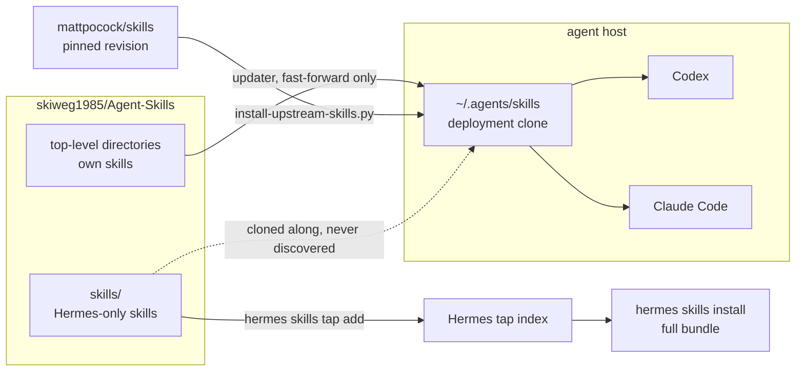

# Agent Skills

Shared, public [Agent Skills](https://agentskills.io/) for autonomous coding agents such as OpenAI Codex and Claude Code.

## How this repository reaches an agent

One repository, two distribution surfaces, plus a third-party source that is never
stored here.



| Surface | Path | Consumed by | Stored in this repository |
| --- | --- | --- | --- |
| Own skills | `<skill-name>/` | Codex, Claude Code | yes |
| Hermes tap | `skills/<skill-name>/` | Hermes | yes |
| Upstream skills | `<skill-name>/`, installed | Codex, Claude Code | no, declared only |

The updater validates the first two and deploys the first and third. Discovery and
validation are deliberately separate, so a Hermes-only skill stays invisible to the
other agents without escaping the metadata checks.

## Included skills

- `agent-host-operations` — safe conventions for autonomous work on a shared agent host.
- `cost-aware-agent-routing` — route work between low-cost and premium coding agents.
- `documentation-standards` — keep software-repository documentation accurate, lean, and task-oriented.
- `linear-coordinate-agents` — coordinate parallel agents through Linear, repository working agreements, isolated worktrees, and review gates.
- `schreibstil-pruefen` — review and improve German technical writing against repository conventions and a measured fallback style guide.
- `skill-repository-sync` — safely update a deployed clone of this repository through an externally installed updater.

## Skills published for the Hermes tap

`skills/` is a second distribution surface, not a stray directory. Hermes registers
this repository as a tap and indexes exactly that path:

```bash
hermes skills tap add skiweg1985/Agent-Skills
```

A skill placed in `skills/<skill-name>/` is discoverable through that tap and is
deliberately **not** discovered by Codex or Claude Code, which only read the top
level. Currently published this way: `a3-cron-coordinator`.

Three consequences worth knowing:

- Hermes installs the complete bundle — `SKILL.md` plus `scripts/`, `references/`,
  and `templates/`. Keep such a skill self-contained; do not install it from a raw
  `SKILL.md` URL, which fetches that one file and silently drops the rest.
- A tap reads the repository's default branch, so a change becomes tap-visible only
  after it lands on `main`.
- The updater validates `skills/*/SKILL.md` with the same rules as the top level but
  never deploys it to `~/.agents/skills`. Validation and discovery are separate on
  purpose: a broken skill here cannot ship to Hermes unnoticed, and a Hermes-only
  skill does not appear in the other agents.

Put a skill at the top level when the agents on a host should load it, and under
`skills/` when it is meant for the tap.

## Skills installed from upstream

This repository stores only its own skills. Third-party collections are declared in
[`skill-repository-sync/upstream-skills.json`](skill-repository-sync/upstream-skills.json)
and installed straight from their source by the updater, so they stay available in
every agent without being copied into this repository.

Currently declared: **37 MIT-licensed engineering and productivity skills** from
[`mattpocock/skills`](https://github.com/mattpocock/skills), eight of which upstream
marks as in progress. See [`THIRD_PARTY_NOTICES.md`](THIRD_PARTY_NOTICES.md) for
provenance and license.

Installed directories are excluded from Git inside the deployment clone, so the
updater's dirty check keeps protecting genuine local changes. Run the updater once
after cloning to materialize them.

## Installation

Follow the section for the agent you are installing on. The surfaces are
independent; a host may use one or both.

### Codex and Claude Code

Codex discovers user-level skills in `~/.agents/skills`. Claude Code discovers
personal skills in `~/.claude/skills` and follows symlinks.

```bash
git clone https://github.com/skiweg1985/Agent-Skills.git ~/.agents/skills
mkdir -p ~/.claude
ln -s ../.agents/skills ~/.claude/skills
```

If either path already exists, back it up and reconcile its contents before
cloning. Do not overwrite existing skills blindly.

Then install the updater outside the clone and run it once. Until it runs, only
this repository's own skills are present — the upstream skills are declared, not
stored, and the updater fetches them:

```bash
install -Dm755 \
  ~/.agents/skills/skill-repository-sync/scripts/update-agent-skills.sh \
  ~/.local/bin/update-agent-skills
~/.local/bin/update-agent-skills
```

A successful run reports how many skills it installed and validated.

### Hermes

Hermes registers this repository as a tap and indexes `skills/`. Skills are then
searched and installed deliberately, one at a time:

```bash
hermes skills tap add skiweg1985/Agent-Skills
hermes skills search a3-cron-coordinator
hermes skills install a3-cron-coordinator
```

`hermes skills tap list` shows the effective path per tap; it must be `skills/`
for this repository. Install the whole skill through the tap rather than
fetching a raw `SKILL.md` URL — a skill's `scripts/`, `references/`, and
`templates/` are part of it, and a single-file fetch silently drops them.

Only Hermes-exclusive skills live on the tap. Shared skills such as
`linear-coordinate-agents` and `cost-aware-agent-routing` sit at the top level
and do not reach Hermes this way. How they will is settled in
[the distribution decision](docs/decisions/hermes-skill-distribution.md) — a
curated directory filled by the updater and referenced from
`skills.external_dirs` in `~/.hermes/config.yaml`. **That mechanism is decided
but not yet built.** Until it is, a Hermes host has the tap surface only.

### Verifying an installation

```bash
~/.local/bin/update-agent-skills          # Codex, Claude Code: sync and validate
hermes skills list                        # Hermes: what is installed and enabled
```

## Automatic updates

The updater is installed outside the repository so that an ordinary pull cannot
change the program cron executes. Run it manually:

```bash
~/.local/bin/update-agent-skills
```

A cron example is included in the `skill-repository-sync` skill. The updater only
accepts the expected GitHub remote, refuses a dirty deployment clone, performs a
fast-forward-only update, installs the declared upstream skills at their pinned
revisions, validates skill metadata, and rolls back to the previous commit if
installation or validation fails.

The updater does not replace itself. After a change to
`skill-repository-sync/scripts/update-agent-skills.sh`, reinstall it explicitly:

```bash
install -Dm755 \
  ~/.agents/skills/skill-repository-sync/scripts/update-agent-skills.sh \
  ~/.local/bin/update-agent-skills
```

## Project-specific skills

This repository is intended for skills that should apply across projects. Keep project-specific instructions in the repository that owns the project:

- Codex: `.agents/skills/<skill-name>/SKILL.md`
- Claude Code: `.claude/skills/<skill-name>/SKILL.md`

## Public repository policy

Never commit credentials, tokens, customer data, private infrastructure details, or sensitive logs. Use example identifiers and sanitized evidence only.
