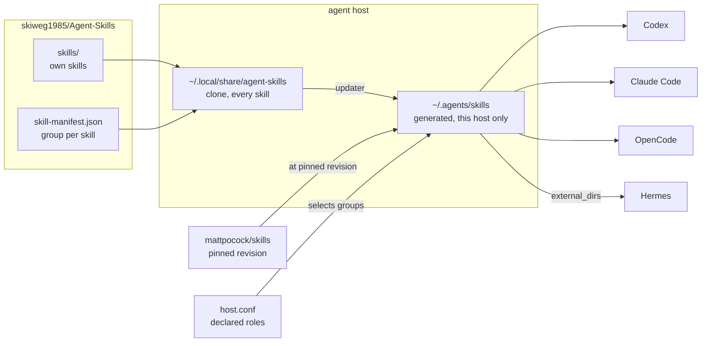

# Agent Skills

Shared, public [Agent Skills](https://agentskills.io/) for autonomous coding
agents. One repository serves Codex, Claude Code, OpenCode and Hermes, and each
host receives only the skills its declared roles call for.

## How a skill reaches an agent



The clone holds every skill; the delivery directory holds only what this host
selected. A coordinator does not merely refrain from using implementation
skills — it does not have them.

## Roles and groups

Every skill declares one or more groups in
[`skills/skill-repository-sync/skill-manifest.json`](skills/skill-repository-sync/skill-manifest.json).
Every host declares roles. The updater installs the intersection.

| Group | Contents |
| --- | --- |
| `base` | `agent-host-operations`, `linear-coordinate-agents`, `skill-repository-sync`, `documentation-standards`, `schreibstil-pruefen` |
| `coordinator` | the orchestrator and `cost-aware-agent-routing` |
| `worker` | the skills installed from [`mattpocock/skills`](https://github.com/mattpocock/skills) |
| `maintainer` | `improve-remote-orchestration` — turning real runs into skill changes |

`linear-coordinate-agents` is in `base` rather than `coordinator`: most of it
addresses the agent doing the work — claiming an issue, commit attribution,
comment signatures, blockers and handoff.

**A skill with no group aborts the sync.** That keeps a skill from disappearing
silently and stops an upstream source from introducing one without a deliberate
assignment. Reasoning is in
[the distribution decision](docs/decisions/role-based-skill-distribution.md).

## Installation

### 1. Clone and declare this host's roles

```bash
git clone https://github.com/skiweg1985/Agent-Skills.git ~/.local/share/agent-skills

mkdir -p ~/.config/agent-skills
printf 'AGENT_SKILLS_ROLES="base worker"\n' > ~/.config/agent-skills/host.conf
```

Omit the file and the host gets `base` alone — a host is never a coordinator by
accident. Use `"base coordinator"` on the machine that orchestrates and
`"base worker"` on machines that implement. `AGENT_SKILLS_ROLES` in the
environment overrides the file.

### 2. Install the updater and run it once

```bash
install -Dm755 \
  ~/.local/share/agent-skills/skills/skill-repository-sync/scripts/update-agent-skills.sh \
  ~/.local/bin/update-agent-skills
~/.local/bin/update-agent-skills
```

This generates `~/.agents/skills`. Nothing is discoverable before it runs.

### 3. Point the agent at the delivery directory

**Codex** reads `~/.agents/skills` directly. Nothing to do.

**Claude Code** reads `~/.claude/skills` and follows symlinks:

```bash
mkdir -p ~/.claude
ln -s ../.agents/skills ~/.claude/skills
```

**OpenCode** already reads `~/.agents/skills` and `~/.claude/skills` natively.
Nothing to do.

**Hermes** reads its own directory plus any path in `skills.external_dirs`:

```yaml
# ~/.hermes/config.yaml
skills:
  external_dirs:
    - ~/.agents/skills
```

The repository can also be registered as a Hermes tap
(`hermes skills tap add skiweg1985/Agent-Skills`, indexing `skills/`). That is a
browsable catalog for deliberate manual installs; it delivers nothing by default,
because a tap would bypass the role mechanism. Install a skill whole rather than
fetching a raw `SKILL.md` URL — `scripts/`, `references/` and `templates/` are
part of a skill and a single-file fetch drops them.

If any of these paths already exists, back it up and reconcile before pointing
the agent at it. Do not overwrite existing skills blindly.

## Keeping a host current

```bash
~/.local/bin/update-agent-skills
```

A cron example is in the `skill-repository-sync` skill. The updater accepts only
the expected remote, refuses a dirty clone, updates fast-forward only, installs
the selected skills, validates metadata, and rolls back on failure.

Every run writes `~/.local/state/agent-skills/sync-status.json` with the outcome,
the commit, the roles, and a separate `lastSuccessAt`. Under cron a failure is
otherwise silent, so **check that record when a skill is unexpectedly missing**:

```bash
python3 -c "import json;d=json.load(open('$HOME/.local/state/agent-skills/sync-status.json'));print(d['outcome'], d['lastSuccessAt'])"
```

A `lastSuccessAt` older than roughly twice the cron interval means the sync has
been failing.

The updater does not replace itself, so an ordinary pull cannot change what cron
executes. After a change to the updater script, reinstall it explicitly with the
command from step 2.

## Third-party skills

Skills from other projects are declared, not stored here. The manifest names the
source repository, its pinned revision, and each skill's group; the updater
installs them from upstream. See
[`THIRD_PARTY_NOTICES.md`](THIRD_PARTY_NOTICES.md) for provenance and licensing.

## Project-specific skills

Keep instructions that belong to one project in that project's repository:

- Codex: `.agents/skills/<skill-name>/SKILL.md`
- Claude Code: `.claude/skills/<skill-name>/SKILL.md`
- OpenCode: `.opencode/skills/<skill-name>/SKILL.md`

## Public repository policy

Never commit credentials, tokens, customer data, private infrastructure details,
or sensitive logs. Use example identifiers and sanitized evidence only.
